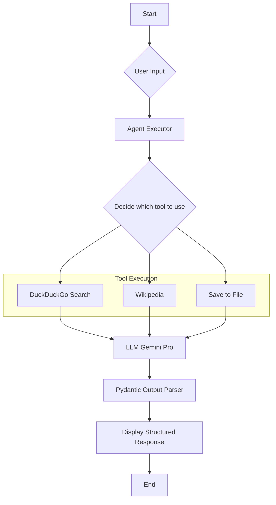

# LangChain Conversational Agent with Gemini Pro and React UI

This project is a full-stack conversational AI application that leverages LangChain and Google's Gemini Pro model on the backend, with a responsive React frontend. The agent is equipped with tools to search the web, look up information on Wikipedia, and save its findings to a local file, and the user can interact with it through a web interface.

## What Makes This Project Different?

While there are many conversational AI projects, this one stands out for a few key reasons:

-   **Full-Stack Application:** This project is not just a command-line tool, but a complete web application with a React frontend and a Flask backend.
-   **Powered by Gemini Pro:** It specifically showcases the integration of Google's powerful Gemini Pro model, providing a modern alternative to other commonly used LLMs.
-   **Reliable, Structured Output:** By using Pydantic models for output parsing, the agent guarantees that its responses are in a predictable, structured format. This makes the output reliable and easy to use in downstream applications.
-   **Custom Tool Integration:** The project includes a custom tool (`save_to_txt`) that demonstrates how to extend the agent's capabilities beyond standard library functions. This serves as a practical template for adding your own unique tools.
-   **A Clear Learning Blueprint:** The codebase is intentionally kept clean and focused, making it an excellent starting point for developers who want to learn how to build tool-using agents with LangChain without unnecessary complexity.

## Features

-   **Web-based Conversational Interface:** Interact with the agent through a user-friendly web interface.
-   **Tool-Powered:** The agent can use DuckDuckGo for web searches and access Wikipedia for specific queries.
-   **Structured Output:** The agent returns a Pydantic model with the topic, a concise summary, a list of sources, and the tools it used.
-   **Save Results:** A custom tool allows you to save the agent's output to a text file (`chain_output.txt`) for later reference.

## Architecture

The application is divided into two main parts:

-   **Frontend:** A React application built with Vite that provides the user interface for interacting with the agent.
-   **Backend:** A Flask server that exposes a REST API. The backend uses LangChain and the Gemini Pro model to process user queries and execute tools.

## Getting Started

### Prerequisites

-   Python 3.10 or higher
-   Node.js 18 or higher
-   An API key for Google's Gemini Pro model

### Installation

1.  **Clone the repository:**
    ```bash
    git clone https://github.com/YUHESHWAR/AI-Agent-Langchain.git
    cd AI-Agent-Langchain
    ```

2.  **Set up the backend:**
    -   Create a virtual environment:
        ```bash
        python3 -m venv .venv
        source .venv/bin/activate
        ```
    -   Install the dependencies:
        ```bash
        pip install -r requirements.txt
        ```
    -   Set up your environment variables:
        Create a `.env` file in the root of the project and add your Google API key:
        ```
        GOOGLE_API_KEY="YOUR_API_KEY_HERE"
        ```

3.  **Set up the frontend:**
    -   Navigate to the frontend directory:
        ```bash
        cd frontend
        ```
    -   Install the dependencies:
        ```bash
        npm install
        ```

### Running the Application

The easiest way to run the application is to use the `dev:full` script from the `frontend` directory, which will start both the backend and frontend servers concurrently.

1.  **Navigate to the frontend directory:**
    ```bash
    cd frontend
    ```

2.  **Run the `dev:full` script:**
    ```bash
    npm run dev:full
    ```

This will start the Flask backend on port 5001 and the React frontend on port 5173 (or another available port). You can access the application in your browser at the address provided by Vite.

### Running the Backend and Frontend Separately

If you prefer to run the backend and frontend servers in separate terminals:

-   **To run the backend:**
    From the root directory:
    ```bash
    source .venv/bin/activate
    python app.py
    ```

-   **To run the frontend:**
    From the `frontend` directory:
    ```bash
    npm run dev
    ```

## Workflow

The agent follows the process outlined in the flowchart below to handle a user's query.



## How It Works

1.  **User Input:** The React frontend captures your query and sends it to the Flask backend's `/api/chat` endpoint.
2.  **Agent Execution:** The query is passed to a LangChain `AgentExecutor`, which decides which tool (or sequence of tools) is best suited to answer the query.
3.  **Tool Usage:** The agent can use:
    -   `DuckDuckGoSearchRun` to search the web.
    -   `WikipediaQueryRun` to get information from Wikipedia.
    -   A custom `save_to_txt` tool to append the structured output to `chain_output.txt`.
4.  **Response Generation:** The results from the tools are passed to the Gemini Pro model, which generates a structured response.
5.  **Output Parsing:** The response is parsed into a Pydantic `ResponseModel` object, which is then sent back to the frontend and displayed to the user.
