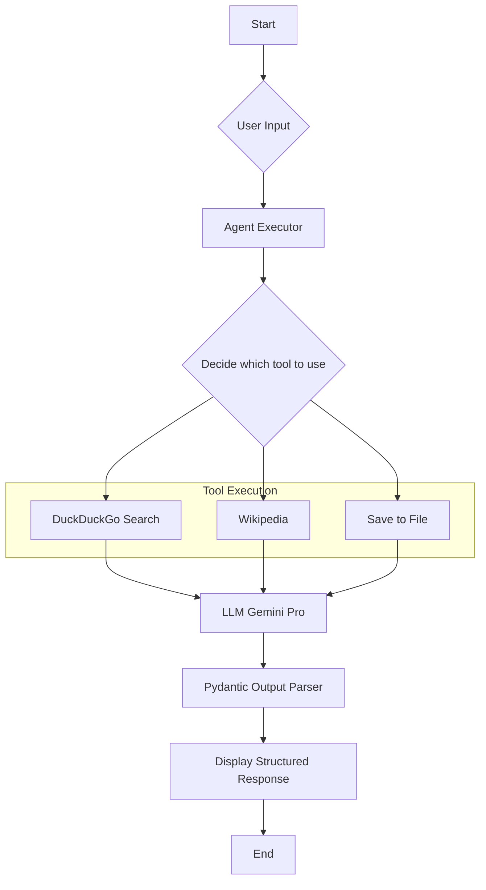

# LangChain Conversational Agent with Gemini Pro

This project is a conversational AI agent that leverages LangChain and Google's Gemini Pro model to provide structured summaries on a wide range of topics. The agent is equipped with tools to search the web, look up information on Wikipedia, and save its findings to a local file.

## What Makes This Project Different?

While there are many conversational AI projects, this one stands out for a few key reasons:

-   **Powered by Gemini Pro:** It specifically showcases the integration of Google's powerful Gemini Pro model, providing a modern alternative to other commonly used LLMs.
-   **Reliable, Structured Output:** By using Pydantic models for output parsing, the agent guarantees that its responses are in a predictable, structured format. This makes the output reliable and easy to use in downstream applications.
-   **Custom Tool Integration:** The project includes a custom tool (`save_to_txt`) that demonstrates how to extend the agent's capabilities beyond standard library functions. This serves as a practical template for adding your own unique tools.
-   **A Clear Learning Blueprint:** The codebase is intentionally kept clean and focused, making it an excellent starting point for developers who want to learn how to build tool-using agents with LangChain without unnecessary complexity.

## Features

-   **Conversational Interface:** Interact with the agent through a simple command-line interface.
-   **Tool-Powered:** The agent can use DuckDuckGo for web searches and access Wikipedia for specific queries.
-   **Structured Output:** The agent returns a Pydantic model with the topic, a concise summary, a list of sources, and the tools it used.
-   **Save Results:** A custom tool allows you to save the agent's output to a text file (`chain_output.txt`) for later reference.

## Getting Started

### Prerequisites

-   Python 3.10 or higher
-   An API key for Google's Gemini Pro model

### Installation

1.  **Clone the repository:**
    ```bash
    git clone https://github.com/YUHESHWAR/AI-Agent-Langchain.git
    cd AI-Agent-Langchain
    ```

2.  **Create a virtual environment:**
    ```bash
    python3 -m venv .venv
    source .venv/bin/activate
    ```

3.  **Install the dependencies:**
    ```bash
    pip install -r requirements.txt
    ```

4.  **Set up your environment variables:**
    Create a `.env` file in the root of the project and add your Google API key:
    ```
    GOOGLE_API_KEY="YOUR_API_KEY_HERE"
    ```

### Running the Agent

To start the agent, run the `main.py` script:

```bash
python3 main.py
```

The agent will then prompt you with: `what can I help you with today?`. Enter your query and the agent will begin its work.

## Workflow

The agent follows the process outlined in the flowchart below to handle a user's query.



## How It Works

The agent is built using the LangChain framework and follows these steps:

1.  **User Input:** The `main.py` script captures your query from the command line.
2.  **Agent Execution:** The query is passed to a LangChain `AgentExecutor`, which decides which tool (or sequence of tools) is best suited to answer the query.
3.  **Tool Usage:** The agent can use:
    -   `DuckDuckGoSearchRun` to search the web.
    -   `WikipediaQueryRun` to get information from Wikipedia.
    -   A custom `save_to_txt` tool to append the structured output to `chain_output.txt`.
4.  **Response Generation:** The results from the tools are passed to the Gemini Pro model, which generates a structured response.
5.  **Output Parsing:** The response is parsed into a Pydantic `ResponseModel` object, which is then printed to the console.
